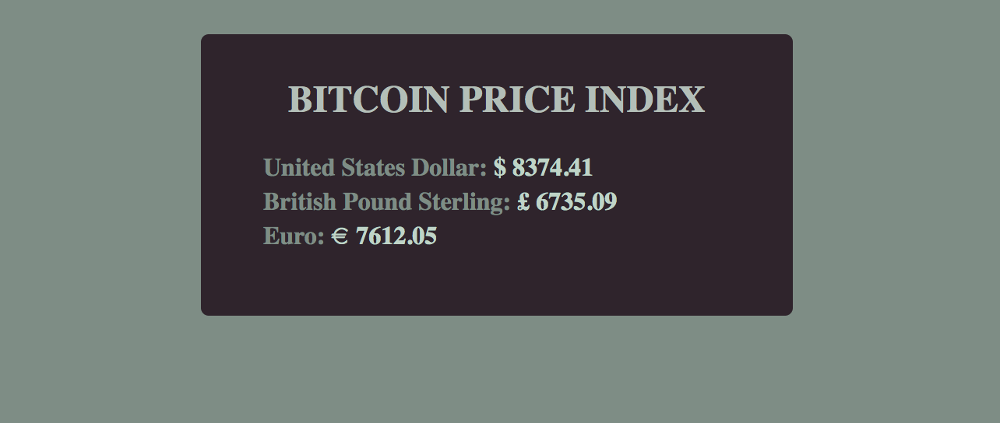
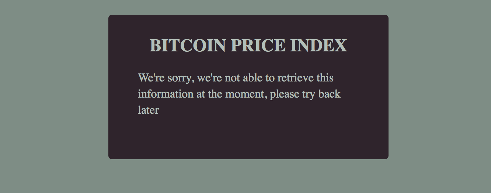

### CoinDesk Bitcoin Price Index API

```


 
```

### Vue example using axios to consume APIS

```
Following along https://vuejs.org/v2/cookbook/using-axios-to-consume-apis.html

In this example I've been including vue directly with a script tag - since this repository
is for learning purposes.

<script src="https://cdn.jsdelivr.net/npm/vue "></script>
 

```

### Include Axios directly

```

For this example you have to make sure to include axios directly too within the index.html 

<script src="https://cdn.jsdelivr.net/npm/vue "></script>
<script src="https://unpkg.com/axios/dist/axios.min.js"></script>
 
```